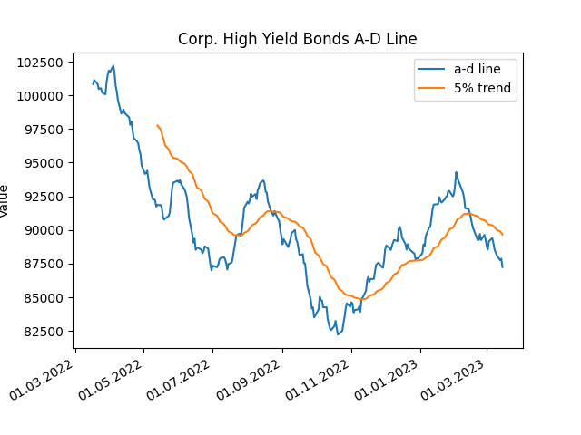

# finra_bonds

a tool to read market aggregate information for bonds from morningstar.com

Note: in order to receive data, you require a cookie, that needs to be provided to the tool, so a valid request can be created

Also, the current implementation uses a mongodb for persistence of data

## usage

in the current form, we use simple scripts to run the different tasks, in a further update the commands will be combined to a command-line tool

* fb_chart.py reads data from the database and displays them
* fb_update.py reads the data from the web and stores them in the database