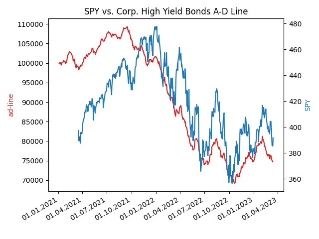

# Corporate High Yield Bonds



a tool to read market aggregate information for bonds from morningstar.com

Note: in order to receive data, you require a cookie, that needs to be provided to the tool, so a valid request can be created

Also, the current implementation uses a mongodb for persistence of data


## preparation

recommend a mongodb instance to store the data

## usage

````
usage: fb.py [-h] [-t T]

read and display corporate high yield bonds

optional arguments:
  -h, --help  show this help message and exit
  -t T        the task to perform, default update, others: chart
```

